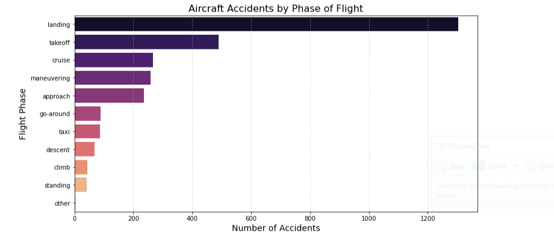

# Aviation Risk Evaluation

**Author:** Kelvin Kipkorir  


# Overview

SafeWings is expanding into the aviation industry, aiming to identify safe aircraft models and risks associated with aviation business operations. This project analyzes aviation accident data from the National Transportation Safety Board (NTSB) from 1962 to 2023 to uncover trends in aircraft safety, accident causes, and manufacturer reliability. Descriptive statistical analysis examines accident frequencies, common risk factors such as human error and mechanical failures, and manufacturers with the lowest incident rates. Findings indicate that selecting aircraft from manufacturers with strong safety records, investing in modern aviation technology, and enhancing pilot training and maintenance programs can significantly reduce risks. These insights support SafeWings in making informed decisions.

# Business Problem

SafeWings is expanding into new industries to diversify its portfolio. Specifically, there is interest in purchasing and operating airplanes for commercial and private enterprises, but knowledge about potential aircraft risks is limited. To address this, aviation accident data will be analyzed to identify aircraft with the lowest risk. This analysis focuses on factors such as accident rates, causes, and operational conditions. Actionable insights derived from this research will support data-driven decisions on aircraft purchases, ensuring both safety and business sustainability.

# Data

The dataset used in this analysis originates from the National Transportation Safety Board (NTSB) and was obtained from [Kaggle](https://www.kaggle.com/datasets/khsamaha/aviation-accident-database-synopses).  
It includes aviation accident records from 1962 to 2023, providing insights into accident patterns, aircraft risks, and contributing factors.  

Each row in the dataset represents a recorded aviation accident or incident within:  
- The United States and its territories  
- International waters (if involving U.S. aircraft)  

The dataset contains **88,889 rows and 31 columns**, covering details such as:  
- **Aircraft Information** - Make, Model, Category, Number of Engines  
- **Accident Details** - Date, Location, Weather Conditions, Phase of Flight  
- **Consequences** - Injury Severity, Aircraft Damage  

### Key Variables:
- **`Make`** - Identifies the aircraft manufacturer.  
- **`Model`** - Specifies the aircraft type.  
- **`Broad.phase.of.flight`** - Indicates when the accident occurred (e.g., takeoff, landing).  
- **`Weather.Condition`** - Defines if the accident occurred under VMC (good weather) or IMC (bad weather).  
- **`Number.of.Engines`** - Indicates aircraft engine count.  
- **`Injury.Severity`** - Categorizes accidents based on fatal, serious, minor, or no injuries.  

# Data Cleaning and Preparation

Before analysis, the dataset was cleaned for relevance. This involved:  

### Dropping Unnecessary Columns  
The dataset originally contained 31 columns, many of which were not relevant to the analysis. The following columns were dropped:  
- **Location Data:** `Longitude`, `Latitude` (Countries and location variables are sufficient)  
- **High Missing Values:** `Schedule`, `Air.carrier`, `FAR.Description` (Too much missing data)  
- **Airport Information:** `Airport.Code`, `Airport.Name` (Not relevant to safety analysis)  
- **Injury Details:** `Total.Minor.Injuries`, `Total.Serious.Injuries`, `Total.Fatal.Injuries`, `Total.Uninjured` (Injury severity alone is enough)  
- **Identifiers & Metadata:** `Accident.Number`, `Investigation.Type`, `Event.ID`, `Registration.Number`, `Report.Status`, `Publication.Date` (Only for record-keeping)  

### Handling Missing Values  
- Key Variables with Missing Data:  
  - `Aircraft.Category` and `Broad.phase.of.flight` had missing values but were important to the analysis, so missing values were filled.  
  - For all other columns, rows with missing values were removed.  

### Filtering and Transforming Data  
- Only non-homebuilt aircraft (`Amateur.Built = "No"`) were included, since the focus is on commercial and certified aircraft.  
- The `Event.Date` column was converted to datetime format to enable time-based analysis.  

### Cleaning Categorical Variables  
- The `Make` column contained inconsistencies and duplicate manufacturer names (e.g., "Boeing Inc." vs. "Boeing"). These were standardized for consistency.  
- Text-based columns were stripped of extra spaces and converted to lowercase to ensure uniform formatting.  

# Visualizations and Results

### 1. Has aviation safety improved over the years, and what does this mean for investment in aviation?   
  

The graph shows a declining trend in aviation accidents from 2000 onward. This suggests that safety measures, technological advancements, and stricter regulations have contributed to fewer incidents.  

For business, this is a positive indicator—investing in aircraft today comes with lower operational risks compared to past decades. With continued improvements in safety protocols and aircraft technology, the aviation industry is becoming an attractive sector for investment.
### 2. Which aircraft manufacturers have the highest number of accidents, and what does this mean for purchasing decisions? 
  
  
**Accident Counts by Manufacturer**  
The stacked bar chart reveals that Cessna, Piper, and Beechcraft have the highest number of accidents.  
However, these manufacturers are dominant in general aviation, meaning they simply have more aircraft in operation.  

 **Accident Severity**  
While Cessna has the most total accidents, its accidents are not disproportionately severe compared to others. This suggests that while Cessna aircraft are frequently used, they may not be inherently unsafe.  

**Accidents Over Time**  
The line graph shows that Cessna has consistently had more accidents than other manufacturers, followed by Airbus.  
All other manufacturers have overlapping accident trends, indicating relatively similar safety records.  

**Key Takeaways for Business:**  
- **High accident numbers do not necessarily mean high risk.** Cessna leads in accidents because of its high production volume in general aviation.  
- **For commercial aircraft, Airbus and Boeing dominate, but their accident trends are stable.**  

### 3. Which aircraft models have historically had the most and least accidents, and how does this influence investment  decisions?
  
  
The first visualization shows the top 10 aircraft models with the most accidents per decade, while the second highlights models with the fewest recorded accidents. Notably, models such as the Cessna 150, 172, and Piper PA-28 series have experienced higher accident counts, possibly due to their widespread use in flight training and general aviation. On the other hand, models in the bottom 10 have consistently maintained a low accident record.

For investment or operational decisions, high-accident models may indicate higher operational risks, maintenance costs, and insurance premiums, while low-accident models suggest better safety records and reliability. However, the popularity of an aircraft can also contribute to its accident frequency, meaning that higher accident numbers do not always equate to a lack of safety but rather a larger fleet size.

### 4. What are the accident trends across different aircraft categories, and which category poses the highest operational risk?  
  
The bar chart visualizes aircraft accidents by category, excluding unknown classifications. Airplanes account for the vast majority of accidents 15,128, followed by helicopters 1,903. Other categories such as weight-shift, powered parachutes, and gliders have significantly fewer recorded accidents.

This trend suggests that airplanes and helicopters require more stringent safety measures, operational protocols, and risk mitigation strategies due to their higher accident rates. However, these numbers may also be influenced by fleet size and frequency of use, meaning higher accident counts don’t necessarily indicate lower safety standards.  

### 5. Which flight categories are most prone to accidents, and how does this impact investment strategy?
  
From the Aircraft Accidents by Flight Category bar chart, General Aviation accounts for the highest number of accidents, followed by Training and Aerial Work. This suggests that private and small-scale flights are the most vulnerable to accidents.

The Aircraft Accidents Over Time by Flight Purpose line graph highlights that while General Aviation accidents have declined significantly after 2015, they still dominate in total numbers. Training-related accidents remain steady, indicating a consistent risk in pilot training operations.

**Commercial vs. Private Investment:** Since commercial aviation has fewer accidents than General Aviation, SafeWings may prioritize investing in commercial aircraft for lower risk and higher safety compliance.    

### 6. Which Phases of Flight Pose the Highest Risk?
  
The bar chart shows that landing and takeoff phases account for the highest number of accidents, aside from an "unknown" category. These phases are the most critical in aviation, as they involve complex maneuvers, high pilot workload, and potential external risk factors like weather conditions and runway obstacles.

This means that our company should:
- **Focusing on rigorous pilot training** for takeoff and landing procedures to reduce human error.  
- **Investing in aircraft with strong reliability records** during these phases to minimize risks.  

### 7.How does weather condition influence the number of aircraft accidents, and are there specific locations where bad weather contributes significantly to accidents?  
  
Weather conditions in aviation are categorized into Visual Meteorological Conditions (VMC) and Instrument Meteorological Conditions (IMC):

- VMC (Visual Meteorological Conditions): Weather conditions allow pilots to operate the aircraft using visual references, meaning visibility and cloud clearances meet regulatory minimums.
- IMC (Instrument Meteorological Conditions): Weather conditions require pilots to rely on instruments due to poor visibility, such as fog, heavy rain, or low clouds.

The visuallizations show that:

1. Most accidents occur in VMC rather than IMC.  
   - This is counterintuitive but can be attributed to factors like human error, complacency, or high traffic volume during good weather.  
2. Location-based analysis indicates that areas like Anchorage, Fairbanks, and Palmer (all in Alaska) report high accident counts,  
   - These do not show a strong correlation with bad weather (IMC).  
   - This suggests that other factors, such as terrain challenges or operational risks, play a significant role in accidents at these locations.

#### SafeWings prioritize investments in pilot training, risk prediction analytics, and better safety infrastructure at high-risk locations.
**** 

## [Tableau Dashboard](https://public.tableau.com/app/profile/kelvin.kipkorir/viz/aviation-risk-evaluation/AviationRiskEvaluationDashboard)

  

# Conclusions

### Key Findings:
- **Aircraft safety varies with model and manufacturer** - Some manufacturers have consistently lower accident rates, making their aircraft safer choices.

- **Accident Trends Have Declined** - Advancement in technology and stricter regulations have reduced aviation accidents over time.

- **Key Risk Factors Identified** - Human error, mechanical failures, and adverse weather conditions are among the leading causes of accidents.

- **Data-Driven Aircraft Selection is Essential** - The safest aircraft are not necessarily the most popular ones, highlighting the need for informed decision-making.

### Business Recommendations:
1. Prioritize Aircraft with Low Accident Rates - Select models and manufacturers with strong safety records and low-risk profiles.

2. Invest in Modern Technology - Newer aircraft with automated safety systems reduce human error.

3. Invest in Maintenance & Training Programs - Regular inspections and good pilot education can minimize mechanical and operational failures.

4. Consider Operational Conditions - Flight routes and weather patterns should be factored into risk assessments.

### Limitations & Future Improvements:
- Data Gaps - Many accident records were incomplete, others missing relevant details.
- Advanced Predictive Models - Machine learning could enhance risk forecasting for better decision-making.


## Repository Structure

```
aviation-risk-evaluation/
│── images/
│   ├── cover_image2.jpg
│   ├── acc_year.PNG
│   ├── manu_acc.PNG
│   ├── manu_acc2.PNG
│   ├── models_dec.PNG
│   ├── models_dec2.PNG
│   ├── airplane_category.PNG
│   ├── flight_purpose.PNG
│   ├── weather-loc.PNG
│── data/
│   ├── aviation_accidents.csv
│   ├── cleaned_data.csv
│── aviation-risk-eval.ipynb
│── README.md
│── aviation-risk-eval.pdf
│── presentation-slide.pdf
│── .gitignore